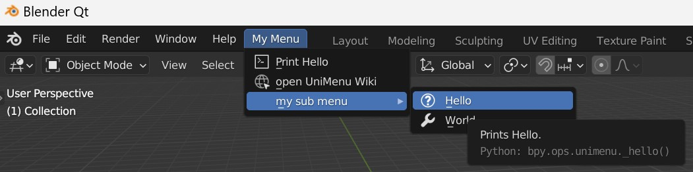
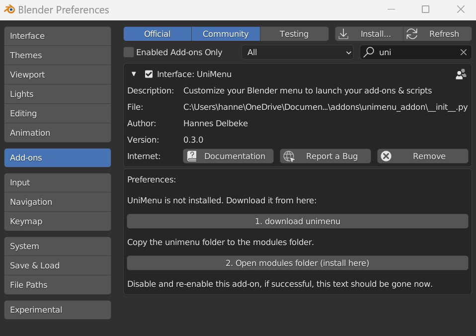

# Unimenu Blender Add-on

A Blender add-on to easily make custom menus in Blender, with [UniMenu](https://github.com/hannesdelbeke/unimenu)<br>
Simply modify the [config](https://github.com/hannesdelbeke/unimenu_addon/blob/main/unimenu_addon/configs/menu.json) in the `unimenu_addon/configs` folder.



Example of a menu config:
```json
{
   "label":"My Menu",
   "items":[
      {
         "label":"Print Hello",
         "command":"print('Hello')"
      }
   ]
}
```
- Run any python command from the menu. Launch tools, add-ons & scripts.
- Customize the menu with icons, tooltips, separators & sub-menus.

This add-on is a self contained environment to quickly get started with UniMenu, so you don't have to setup your own environment in a startup file.<br>
In a studio pipeline, you might want to use the python module instead, with your own startup script.

## Installation
1. Download the addon from this repo, and install this add-on in Blender
2. Install the unimenu python module dependency:

The add-on will show install instructions when enabled. Guiding you with installing the [UniMenu](https://github.com/hannesdelbeke/unimenu) dependency.


## Current Bugs
- on disable, the menu is removed. But on re-enable, 2 menus appear.
- handling more than 1 config in the configs folder is not yet working well
